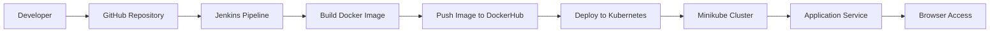

# DevOps CI/CD Pipeline with Jenkins, Docker, and Kubernetes 🚀


---

## DevOps Architecture



---

## CI/CD Pipeline Flow

1. Developer pushes code to **GitHub**
2. **Jenkins pipeline** is triggered
3. Jenkins builds a **Docker image**
4. Image is pushed to **DockerHub**
5. Jenkins deploys the application to **Kubernetes**
6. Application becomes accessible through **Kubernetes service**

---

## Technologies Used

* GitHub – Source Code Management
* Jenkins – CI/CD Automation
* Docker – Containerization
* DockerHub – Image Registry
* Kubernetes – Container Orchestration
* Minikube – Local Kubernetes Cluster

---

## Application Access

After deployment, access the application using:

```
kubectl get svc
```

Example:

```
demo-service   NodePort   80:30007/TCP
```

Get the Minikube IP:

```
minikube ip
```

Open in browser:

```
http://<minikube-ip>:30007
```

---

## Project Structure

```
devops-k8s-demo
│
├── app/                # Node.js demo application
├── k8s/                # Kubernetes manifests
│   ├── deployment.yaml
│   └── service.yaml
│
├── Dockerfile          # Docker image configuration
├── Jenkinsfile         # CI/CD pipeline
└── README.md           # Project documentation
```

---

## Future Improvements

* Add GitHub Webhooks for automatic pipeline triggers
* Implement Helm charts for deployment
* Add monitoring with Prometheus & Grafana
* Deploy to cloud Kubernetes clusters (EKS / GKE / AKS)

---

## Author

Soumimitra
DevOps CI/CD Pipeline Project
